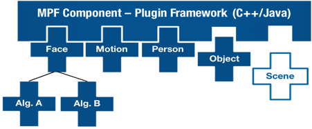

# OpenMPF - _Bridging the Gap in Media Analytics_

## What is The OpenMPF?

OpenMPF performs content detection and extraction (such as face detection, text extraction, and object classification) on bulk image, video, and audio files, enabling content analysis and search through the extraction of objects, keywords, thumbnails, and other contextual information.

This scalable, web-friendly platform enables users to build configurable multimedia processing pipelines, enabling the rapid development and deployment of analytic algorithms and large-scale media processing applications.

## Who is it for?

### Algorithm Developers
If you are developing an algorithm and want to test it in conjunction with other algorithms or compare performance to other algorithms, the OpenMPF is the tool for you.
### Intelligence Analysts
If you have digital media to analyze, the OpenMPF allows you to apply state of the art algorithms in order to identify features like faces, people or motion.
### Data Scientists
If your company has a lot of digital media that needs to be analyzed, the OpenMPF's scalable architecture makes it possible for you to get the job done quickly by adding more processing power as needed.       
### Enterprise Media Processing Users
If you need to process digital media at the enterprise scale, the OpenMPF will scale with your needs and permit you to add your own custom algorithms.

## Features

### Web Interfaces

A Modern Web UI enables users to:

- Build configurable pipelines
- Create and monitor jobs
- Upload files for processing
- Monitor system logs and node status
- Administer configuration properties
- View processing statistics

Additionally, the REST API exposes the same core functionality as the Web UI and enables applications to be built on top of OpenMPF.

### Component Plugin Architecture

The OpenMPF Plugin Architecture provides the ability to seamlessly integrate **detection** , **tracking** , and **classification** algorithms in both C++ and Java. New processing nodes can easily be added to increase processing throughput and new algorithms can be dynamically loaded and scaled to meet user needs.

OpenMPF includes open-source algorithms for **Object** Classification as well as **Face** , **Person** , **Text** , **Speech** , and **Motion** Detection and Tracking.

### Tailored Framework for Media Analytics

Built on **FFMPEG** and **OpenCV** , OpenMPF supports the processing of standard image, video, and audio formats and containers such as:

- JPEG
- JPEG2000
- BMP
- PNG
- WAV
- MPEG4
- And many more

### Customizable Pipelines

OpenMPF provides the ability to organize algorithms sequentially or in parallel. This enables users to create pipelines based on performance (fast -&gt; slow) to increase throughput on large datasets or run multiple concurrent algorithms (e.g., two competing face detection algorithms) to compare performance.

#### For Algorithm Developers - _You focus on the algorithms, we'll focus on the rest_

- Scale your code with ease
  - Distributes algorithms across available resources; optimize algorithms for single-threaded performance and let OpenMPF do the rest.
- Standard APIs
  - Simple, easy-to-use C++ and Java APIs for detection, tracking, and classification.
  - Samples implementations available to quickly get started.
- Built-In Performance Testing
  - JSON-formatted results enable the simple comparison and performance evaluation of algorithms.

#### For Enterprise Users and Data Analysts – _Bring modern algorithms to enterprise scale_

- Analyze Your Data, the Way You Want
  - Mix, match, and combine algorithms and configurations to meet analytic needs. Design pipelines intended to improve throughput performance or compare algorithms.
- Non-Proprietary Nature
  - Allows for integration of 'best of breed' algorithms without a pre-defined list of vendors or algorithms.
- Extendable Plugin Framework
  - Out of the box support for well-known algorithms such as Caffe, and DLib and OpenCV face detection.
  - Enables rapid integration of commercial or open-source algorithms.
- Scalable, Web-friendly Architecture
  - REST Web Services and a modern UI provide the capability to manage jobs, manage deployed components, and monitor system status.

## Overview

This repository contains source code for the OpenMPF core, including the majority of the back-end and user interface code. Components (the code that performs the actual processing) can be found in other  [repositories](https://github.com/openmpf/).

This repository is divided into various maven modules, including the node manager, which controls the OpenMPF services running on a given node, and the workflow manager, which is the web application server that manages routing messages and jobs.