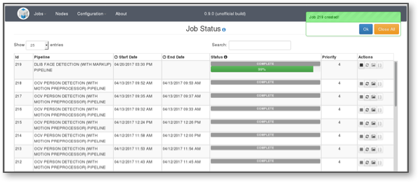
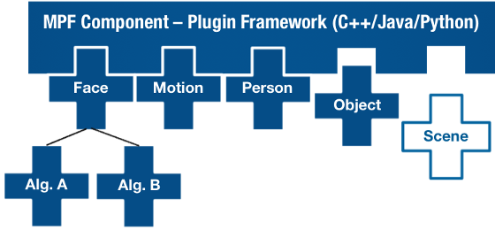
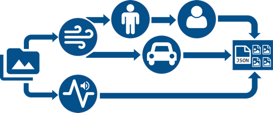

# OpenMPF - _Bridging the Gap in Media Analytics_

## What is the OpenMPF?

The Open Media Processing Framework provides a platform to perform content detection and extraction on bulk multimedia, enabling users to analyze, search, and share information through the extraction of objects, keywords, thumbnails, and other contextual data.

OpenMPF enables users to build configurable media processing pipelines, enabling the rapid development and deployment of analytic algorithms and large-scale media processing applications.

### Search and Share

Simplify large-scale media processing and enable the extraction of meaningful content

### Open API

Apply cutting-edge algorithms such as face detection and object classification

### Flexible Architecture

Integrate into your existing environment or use OpenMPF as a standalone application

## Who is it for?

### Algorithm Developers
If you are developing an algorithm and want to test it in conjunction with other algorithms or compare performance to other algorithms, OpenMPF is the tool for you.

### Intelligence Analysts
If you have digital media to analyze, OpenMPF allows you to apply state of the art algorithms in order to identify features like faces, people or motion.

### Data Scientists
If your company has a lot of digital media that needs to be analyzed, OpenMPF's scalable architecture makes it possible for you to get the job done quickly by adding more processing power as needed.   

### Enterprise Media Processing Users
If you need to process digital media at the enterprise scale, OpenMPF will scale with your needs and permit you to add your own custom algorithms.

## Features

### Web Interfaces

A Modern Web UI enables users to:

- Build configurable pipelines
- Create and monitor jobs
- Upload files for processing
- Monitor system logs and node status
- Administer configuration properties
- View processing statistics

Additionally, the REST API exposes the same core functionality as the Web UI and enables applications to be built on top of OpenMPF.

### Component Plugin Architecture

The OpenMPF Plugin Architecture provides the ability to seamlessly integrate **detection**, **tracking**, and **classification** algorithms in C++, Python, and Java.

New processing nodes can easily be added to increase processing throughput and new algorithms can be dynamically loaded and scaled to meet user needs.

OpenMPF includes open-source algorithms for detecting and tracking:

- Faces - LBP-Based OpenCV
- Motion - MOG, SuBSENSE
- Objects - OpenCV DNN
- Scene Changes - OpenCV
- License Plates - OpenALPR
- Text - Tesseract
- Speech - Sphinx
- And more

### Tailored Framework for Media Analytics

Built on **FFMPEG** and **OpenCV** , OpenMPF supports the processing of standard image, video, and audio formats and containers such as:

- JPEG
- JPEG2000
- BMP
- PNG
- WAV
- MPEG4
- And many more

### Customizable Pipelines

OpenMPF provides the ability to to combine multiple algorithms in a single pipeline. Algorithms can be organized sequentially or in parallel.

This enables users to create pipelines based on performance (fast -&gt; slow) to increase throughput on large datasets or run multiple concurrent algorithms (e.g., two competing face detection algorithms) to compare performance.

#### For Algorithm Developers - _You focus on the algorithms, we'll focus on the rest_

- Scale your code with ease
  - Distributes algorithms across available resources; optimize algorithms for single-threaded performance and let OpenMPF do the rest.
- Standard APIs
  - Simple, easy-to-use C++ and Java APIs for detection, tracking, and classification.
  - Samples implementations available to quickly get started.
- Built-In Performance Testing
  - JSON-formatted results enable the simple comparison and performance evaluation of algorithms.

#### For Enterprise Users and Data Analysts – _Bring modern algorithms to enterprise scale_

- Analyze Your Data, the Way You Want
  - Mix, match, and combine algorithms and configurations to meet analytic needs. Design pipelines intended to improve throughput performance or compare algorithms.
- Non-Proprietary Nature
  - Allows for integration of 'best of breed' algorithms without a pre-defined list of vendors or algorithms.
- Extendable Plugin Framework
  - Out of the box support for well-known algorithms such as Caffe and OpenCV face detection.
  - Enables rapid integration of commercial or open-source algorithms.
- Scalable, Web-friendly Architecture
  - REST Web Services and a modern UI provide the capability to manage jobs, manage deployed components, and monitor system status.

## Overview

This repository contains source code for the OpenMPF core, including the majority of the back-end and user interface code. Components (the code that performs the actual processing) can be found in other  [repositories](https://github.com/openmpf/).

This repository is divided into various maven modules, including the node manager, which controls the OpenMPF services running on a given node, and the workflow manager, which is the web application server that manages routing messages and jobs.

## Where Am I?

- [Parent OpenMPF Project](https://github.com/openmpf/openmpf-projects)
- [OpenMPF Core](https://github.com/openmpf/openmpf) ( **You are here** )
- Components
    * [OpenMPF Standard Components](https://github.com/openmpf/openmpf-components)
    * [OpenMPF Contributed Components](https://github.com/openmpf/openmpf-contrib-components)
- Component APIs:
    * [OpenMPF C++ Component SDK](https://github.com/openmpf/openmpf-cpp-component-sdk)
    * [OpenMPF Java Component SDK](https://github.com/openmpf/openmpf-java-component-sdk)
    * [OpenMPF Python Component SDK](https://github.com/openmpf/openmpf-python-component-sdk)
- [OpenMPF Build Tools](https://github.com/openmpf/openmpf-build-tools)
- [OpenMPF Web Site Source](https://github.com/openmpf/openmpf.github.io)
- [OpenMPF Docker](https://github.com/openmpf/openmpf-docker)

## Getting Started

### To start using OpenMPF

Follow the OpenMPF [Install Guide](https://openmpf.github.io/docs/site/Install-Guide/index.html).

### Project Website

For more information about OpenMPF, including documentation, guides, and other material, visit our [website](https://openmpf.github.io/).

### Project Workboard

For a latest snapshot of what tasks are being worked on, what's available to pick up, and where the project stands as a whole, check out our [workboard](https://github.com/orgs/openmpf/projects/3).
